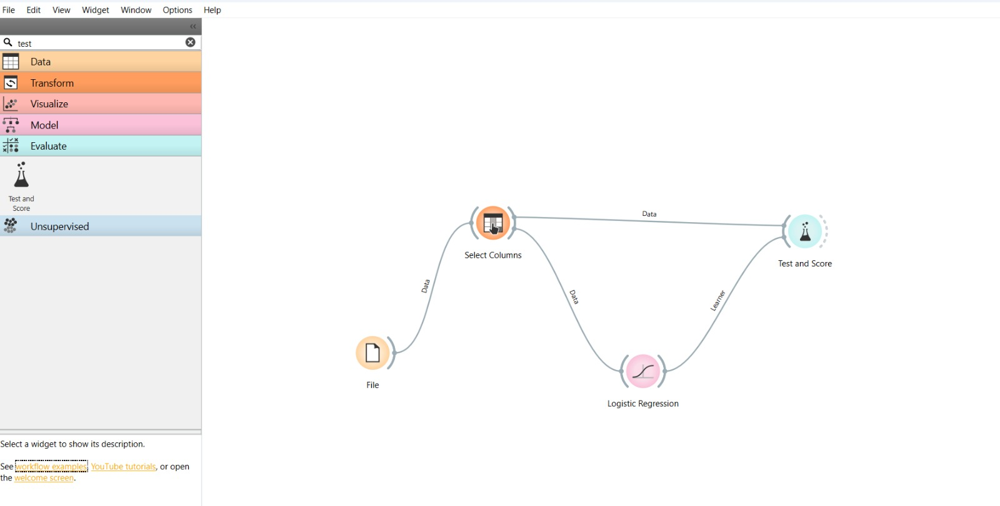

# Logistic Regression Classification Workflow

This repository contains a machine learning workflow built using **Orange Data Mining**. The project demonstrates a standard pipeline for loading data, selecting features, training a Logistic Regression model, and evaluating its performance.

## Workflow Overview

The following screenshot illustrates the visual programming pipeline created in Orange:

---

## Pipeline Components

The workflow consists of four primary nodes (widgets):

1. **File**: Loads the dataset into the environment.
2. **Select Columns**: Used to define the target variable (class) and choose the specific features (independent variables) to include in the model training.
3. **Logistic Regression**: A classification algorithm that trains on the selected data to predict categorical outcomes.
4. **Test and Score**: Evaluates the predictive performance of the Logistic Regression model using cross-validation or a separate test set, providing metrics like AUC, Classification Accuracy, Precision, and Recall.

---

## How to Replicate

1. Open **Orange Data Mining**.
2. Drag and drop the **File**, **Select Columns**, **Logistic Regression**, and **Test and Score** widgets onto your canvas.
3. Connect the widgets exactly as shown in the workflow diagram:
   * **File** `Data` $\rightarrow$ **Select Columns**
   * **Select Columns** `Data` $\rightarrow$ **Test and Score**
   * **Select Columns** `Data` $\rightarrow$ **Logistic Regression**
   * **Logistic Regression** `Learner` $\rightarrow$ **Test and Score**
4. Double-click the **File** widget to load your specific dataset and configure your target variable inside the **Select Columns** widget.
5. Open **Test and Score** to view the performance metrics.
